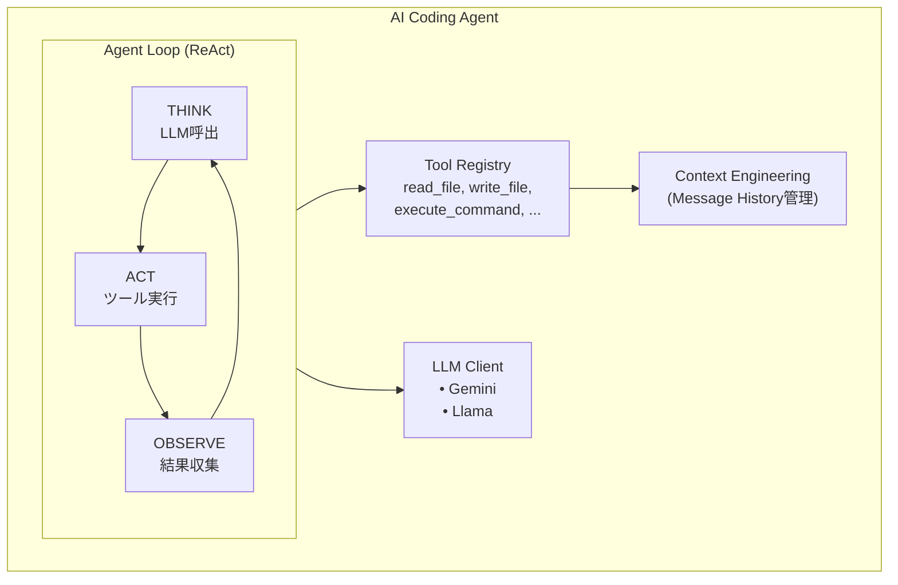
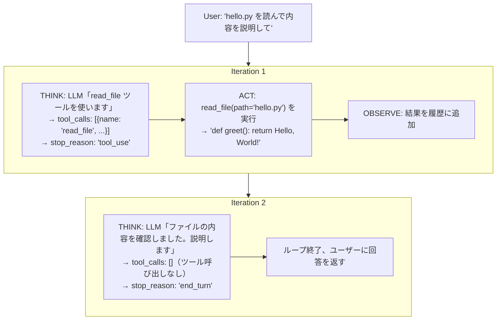
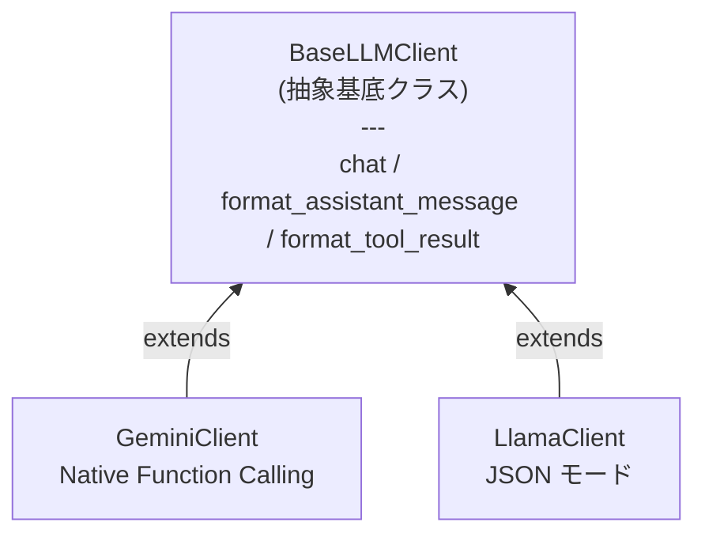
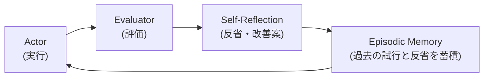
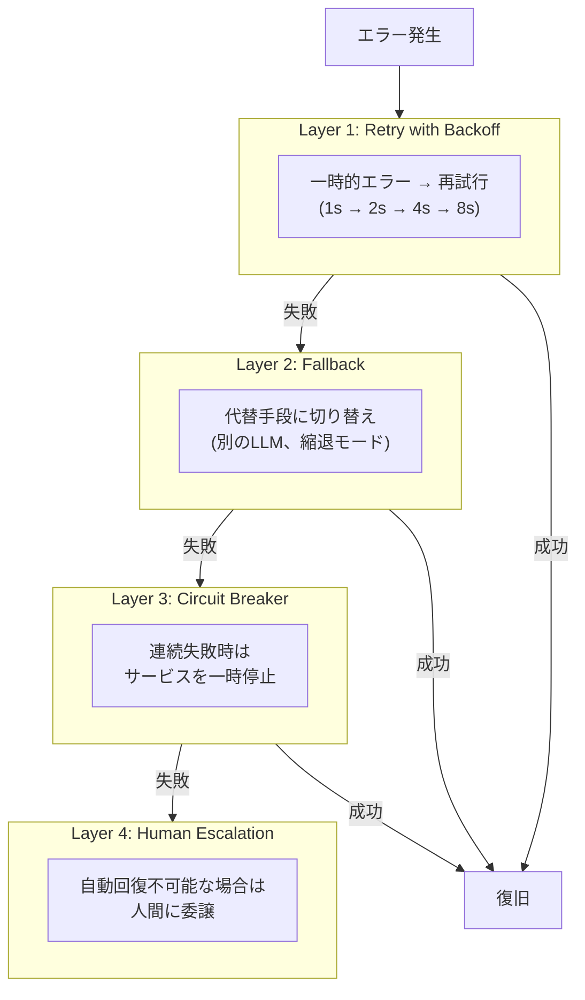

# AI Coding Agent の内部構造はどうなっているのか

**想定時間**: 1時間
**対象**: AI Coding Agent（Claude Code, Cursor, Aider等）の内部動作を理解したいエンジニア

---

## 目次

1. [AI Coding Agent を構成する最低限の要素](#1-ai-coding-agent-を構成する最低限の要素) (15分)
2. [実装を見てみる](#2-実装を見てみる) (25分)
3. [応用的なロジック](#3-応用的なロジック) (15分)
4. [まとめ](#4-まとめ) (5分)

---

## 1. AI Coding Agent を構成する最低限の要素

AI Coding Agent は魔法ではありません。実はシンプルな4つの要素で構成されています。

### 1.1 全体像



### 1.2 Agent Loop（エージェントループ）

AI Coding Agent の心臓部。**ReAct パターン**と呼ばれる Think → Act → Observe のサイクルです。



**ポイント**: `stop_reason` がループ継続/終了を制御します。

| stop_reason | 意味 | 次の動作 |
|-------------|------|---------|
| `"tool_use"` | LLMがツールを使いたい | ACT → OBSERVE → 次のTHINK |
| `"end_turn"` | LLMがタスク完了と判断 | ループ終了 |

### 1.3 Tool Use（Function Calling）

LLM は直接ファイル操作やコマンド実行を行いません。「どのツールをどう呼ぶか」を返し、ホスト側が実際の処理を行います。

#### ステップ1: ツール定義を LLM に送信

```json
{
  "name": "read_file",
  "description": "Read the contents of a file at the specified path.",
  "input_schema": {
    "type": "object",
    "properties": {
      "path": {
        "type": "string",
        "description": "The path to the file to read"
      }
    },
    "required": ["path"]
  }
}
```

この定義は LLM への「説明書」です。LLM はこれを読んで適切なツールを選択します。

#### ステップ2: LLM がツール呼び出しを返す

```json
{
  "text": "ファイルを読みます。",
  "tool_calls": [
    {
      "id": "call_abc123",
      "name": "read_file",
      "input": { "path": "hello.py" }
    }
  ],
  "stop_reason": "tool_use"
}
```

**重要**: LLM は「read_file を呼びたい」という**意図**を返すだけ。実際にファイルを読むのはホスト側。

#### ステップ3: ホスト側でツール実行

```python
for tool_call in response.tool_calls:
    result = tool_registry.execute(
        tool_call.name,     # "read_file"
        tool_call.input,    # {"path": "hello.py"}
    )
```

#### ステップ4: 結果を LLM に返送

```json
{
  "role": "user",
  "content": [{
    "type": "tool_result",
    "tool_use_id": "call_abc123",
    "content": "def greet(): return 'Hello, World!'"
  }]
}
```

### 1.4 Function Calling の仕組み

「LLM がツールを呼ぶ」とはどういうことか、もう少し掘り下げます。

Tool Use（Function Calling）の実現方式は、**API の仕様**によって2つに分かれます。

#### Native Function Calling（Gemini, GPT-4, Claude）

API のレスポンス仕様に `functionCall` 等の**専用フィールド**が定義されています。

```json
// Gemini API のレスポンス（HTTP JSON）
{
  "candidates": [{
    "content": {
      "parts": [
        {
          "functionCall": {
            "name": "read_file",
            "args": {"path": "hello.py"}
          }
        }
      ]
    }
  }]
}
```

SDK がこの JSON を型付きオブジェクトに変換するため、`part.function_call.name` のようにアクセスできます。

#### JSON モード（Llama 等の非対応モデル）

API にツール専用フィールドがないため、テキスト出力の中に JSON を生成させます。

```json
// Ollama API のレスポンス（HTTP JSON）
{
  "message": {
    "content": "{\"thought\": \"...\", \"tool_call\": {\"name\": \"read_file\", \"input\": {\"path\": \"hello.py\"}}}"
  }
}
```

`content` はただの文字列なので、自前で `json.loads()` してパースする必要があります。

#### 何が違いを決めるのか

「Tool Use 対応」は LLM モデル単体の能力ではなく、**3つのレイヤーの組み合わせ**で決まります。

| レイヤー | Gemini | Llama (Ollama) |
|---------|--------|---------------|
| モデルの学習 | Function Calling 用にファインチューニング済み | 部分的に対応 |
| API 仕様 | `functionCall` 専用フィールドあり | テキスト出力のみ |
| SDK | 型付きオブジェクトに自動変換 | なし（自前パース） |

> **補足**: Llama と同じモデルでも、Groq や Together AI など一部のホスティングサービスは独自に Function Calling 対応の API を提供しています。つまり API レイヤーが対応すれば Native Function Calling として使えます。

### 1.5 LLM Client

異なる LLM プロバイダーを抽象化するレイヤーです。



**なぜ抽象化が必要か？**
- プロバイダーごとに API 形式が異なる
- 新しいプロバイダーの追加が容易
- テスト時にモックに差し替え可能

### 1.6 Context Engineering（コンテキスト管理）

LLM はステートレスです。毎回のリクエストで「これまでの会話全体」を送信する必要があります。

```
リクエスト 1:
  messages: [
    {role: "user", content: "hello.py を読んで"}
  ]

リクエスト 2:
  messages: [
    {role: "user", content: "hello.py を読んで"},
    {role: "assistant", content: ..., tool_calls: [...]},
    {role: "user", content: [{type: "tool_result", ...}]},
  ]

リクエスト 3:
  messages: [
    ... さらに蓄積 ...
  ]
```

**MessageHistory クラス**が履歴を管理し、適切な形式で LLM に渡します。

---

## 2. 実装を見てみる

実際のコードを見ていきましょう。`minimal/` は約200行で AI Coding Agent の核心を実装しています。

### 2.1 ファイル構成

```
minimal/
├── src/
│   ├── main.py              # エントリーポイント
│   ├── agent.py             # エージェントループ ★核心
│   ├── tool_registry.py     # ツール管理
│   ├── message_history.py   # 履歴管理
│   ├── llm_clients/
│   │   ├── base.py          # LLMクライアント抽象化
│   │   ├── gemini_client.py # Gemini実装
│   │   └── llama_client.py  # Llama実装
│   └── tools/
│       ├── read_file.py     # ファイル読み込み
│       ├── write_file.py    # ファイル書き込み
│       ├── list_files.py    # ディレクトリ一覧
│       └── execute_command.py # コマンド実行
```

### 2.2 エージェントループ（agent.py）

**これが AI Coding Agent の心臓部です。**

```python
class Agent:
    def run(self, user_input: str) -> str:
        # ユーザー入力を履歴に追加
        self.message_history.add_user_message(user_input)

        for iteration in range(1, self.max_iterations + 1):
            # ========== THINK ==========
            response: LLMResponse = self.llm_client.chat(
                messages=self.message_history.get_messages(),
                tools=self.tool_registry.get_tool_definitions(),
            )

            # アシスタントのレスポンスを履歴に追加
            assistant_msg = self.llm_client.format_assistant_message(response)
            self.message_history.add_raw_message(assistant_msg)

            # 終了条件: stop_reason が "end_turn"
            if response.stop_reason == "end_turn":
                return response.text or ""

            # ========== ACT & OBSERVE ==========
            for tool_call in response.tool_calls:
                # ACT: ツール実行
                result = self.tool_registry.execute(
                    tool_call.name,
                    tool_call.input,
                )

                # OBSERVE: 結果を履歴に追加
                self.message_history.add_tool_result(
                    tool_call.id,
                    result,
                    tool_name=tool_call.name,
                )

        raise RuntimeError("Max iterations reached")
```

**たった50行程度**で Agent Loop が実装できています。

### 2.3 Tool Use の実装（gemini_client.py）

Gemini の Native Function Calling を使用した実装です。

```python
class GeminiClient(BaseLLMClient):
    def chat(self, messages, tools, system=None) -> LLMResponse:
        # 1. メッセージとツールをGemini形式に変換
        gemini_contents = self._convert_messages_to_gemini_format(messages)
        gemini_tools = self._convert_tools_to_gemini_format(tools)

        # 2. API呼び出し
        response = self.client.models.generate_content(
            model=self.model,
            contents=gemini_contents,
            config=types.GenerateContentConfig(
                tools=gemini_tools,
                automatic_function_calling=types.AutomaticFunctionCallingConfig(
                    disable=True  # 手動でfunction callを処理
                ),
            ),
        )

        # 3. レスポンスを統一形式に変換
        text = None
        tool_calls = []

        for part in response.candidates[0].content.parts:
            if part.text:
                text = part.text
            elif part.function_call:
                tool_calls.append(ToolCall(
                    id=f"call_{uuid.uuid4().hex[:8]}",
                    name=part.function_call.name,
                    input=dict(part.function_call.args),
                ))

        # 4. stop_reason を判定
        stop_reason = "tool_use" if tool_calls else "end_turn"

        return LLMResponse(
            text=text,
            tool_calls=tool_calls,
            stop_reason=stop_reason,
        )
```

### 2.4 ツールの実装例（read_file.py）

```python
class ReadFileTool(Tool):
    name = "read_file"
    description = "Read the contents of a file at the specified path."
    input_schema = {
        "type": "object",
        "properties": {
            "path": {
                "type": "string",
                "description": "The path to the file to read",
            },
        },
        "required": ["path"],
    }

    def execute(self, path: str) -> str:
        try:
            with open(path, "r", encoding="utf-8") as f:
                return f.read()
        except FileNotFoundError:
            return f"Error: File not found: {path}"
        except Exception as e:
            return f"Error: {type(e).__name__}: {e}"
```

**ポイント**:
- `input_schema` は JSON Schema 形式で定義
- `execute()` は必ず文字列を返す（エラーも文字列で返す）

### 2.5 Tool Use 非対応モデル（llama_client.py）の工夫

Llama 3.1 8B は Native Function Calling に対応していません。
**JSON モード + プロンプト指示**で Tool Use をシミュレートします。

```python
SYSTEM_PROMPT = """You are a helpful coding assistant.
You have access to the following tools:
{tool_definitions}

When you need to use a tool, respond ONLY with a JSON object:
{{"thought": "your reasoning", "tool_call": {{"name": "tool_name", "input": {{...}}}}}}

When you have the final answer, respond ONLY with:
{{"thought": "your reasoning", "response": "your final response"}}
"""
```

**LLM の出力例**:
```json
{
  "thought": "ファイルを読む必要があります",
  "tool_call": {
    "name": "read_file",
    "input": { "path": "hello.py" }
  }
}
```

これを parse して `tool_calls` に変換します。

### 2.6 実際に動かしてみる

```bash
cd minimal
uv run ai-agent-minimal
```

```
> hello.py を読んで説明して

========================================
Starting agent loop
========================================
[AGENT] Provider: Gemini
[AGENT] User input: hello.py を読んで説明して

----------------------------------------
[AGENT] Iteration 1/10
----------------------------------------
[THINK] Calling LLM for next action...
[THINK] Tool call: read_file

[ACT] Executing tool: read_file
[ACT] Input: {'path': 'hello.py'}

[OBSERVE] Result preview:
def greet():
    return "Hello, World!"

----------------------------------------
[AGENT] Iteration 2/10
----------------------------------------
[THINK] Calling LLM for next action...
[THINK] LLM decided to respond without tools - ending loop

このファイルは greet() 関数を定義しています...
```

---

## 3. 応用的なロジック

minimal/ の ReAct パターンは基本形です。実用的なエージェントには追加のパターンが必要になります。

### 3.1 パターン一覧

| パターン | 目的 | 複雑さ |
|---------|------|--------|
| **Plan-and-Execute** | 複雑なタスクの事前計画 | ★★☆ |
| **Self-Reflection** | 自己改善・精度向上 | ★★☆ |
| **Memory** | 長期記憶・学習 | ★★★ |
| **Multi-Agent** | タスク分割・議論 | ★★★ |
| **Error Recovery** | 信頼性向上 | ★★☆ |

### 3.2 Plan-and-Execute

ReAct は「1ステップずつ判断」しますが、Plan-and-Execute は「最初に全体計画を立てる」パターンです。

```
ReAct:
  Think → Act → Observe → Think → Act → Observe → ...
  (1ステップずつ判断)

Plan-and-Execute:
  Plan（全体計画）→ Execute（順次実行）→ Replan（必要に応じて修正）
  (事前に全体を計画)
```

**使い分け**:
- **ReAct**: シンプルなタスク、即応性が必要
- **Plan-and-Execute**: 複雑なタスク、高精度が必要

```python
# Plan-and-Execute の概要
class PlanExecuteAgent:
    def run(self, goal: str) -> str:
        # Phase 1: PLAN - 全体計画を生成
        plan = self.planner.plan(goal)  # [Step1, Step2, Step3, ...]

        # Phase 2: EXECUTE - 各ステップを実行
        for step in plan:
            result = self.executor.execute(step)

            # Phase 3: REPLAN - 必要に応じて計画を修正
            if result.failed:
                plan = self.replanner.replan(plan, result)

        return final_result
```

→ 詳細は `advanced-examples/plan-and-execute/` を参照

### 3.3 Self-Reflection（Reflexion）

エージェントが自身の出力を批評し、失敗から学習するパターンです。



研究によると、Self-Reflection を使用するエージェントは統計的に有意に高いパフォーマンスを示します。

```python
class ReflexionAgent:
    def run(self, task: str) -> str:
        for trial in range(self.max_trials):
            # 1. Actor: 実行
            result = self.actor.execute(task, self.reflection_memory)

            # 2. Evaluator: 評価
            evaluation = self.evaluator.evaluate(task, result)

            if evaluation.is_success:
                return result

            # 3. Self-Reflection: 失敗を分析
            reflection = self.generate_reflection(task, result, evaluation)
            self.reflection_memory.append(reflection)

        return best_result
```

→ 詳細は `advanced-examples/reflexion/` を参照

### 3.4 Error Recovery

本番環境での信頼性を高めるための多層防御です。



```python
async def execute_with_resilience(operation, fallbacks):
    # Retry with exponential backoff
    for attempt in range(max_retries):
        try:
            return await operation()
        except TransientError:
            await asyncio.sleep(2 ** attempt)

    # Fallback
    for fallback in fallbacks:
        try:
            return await fallback()
        except:
            continue

    raise PermanentError("All recovery attempts failed")
```

#### 縮退モード（Degraded Mode）

Layer 2 の Fallback で登場する「縮退モード」とは、**一部の機能を制限した状態でサービスを継続すること**です。完全停止（0%）ではなく、機能を落としてでも動き続けます。

```
Tier 1: 全機能          GPT-4 で高品質な回答 + コード実行 + テスト
    ↓ 障害発生
Tier 2: 基本機能のみ    GPT-3.5 で回答 + コード生成のみ（実行なし）
    ↓ 障害発生
Tier 3: 最小機能        キャッシュされた定型応答を返す
    ↓ 障害発生
Tier 4: 完全停止        サービス停止、人間にエスカレーション
```

例えば Netflix は推薦エンジンがダウンした際に、パーソナライズなしの人気ランキングを表示します。これも縮退モードの一種です。

→ 詳細は `advanced-examples/error-recovery/` を参照

---

## 4. まとめ

### 4.1 AI Coding Agent の本質

1. **Agent Loop**: Think → Act → Observe のサイクル
2. **Tool Use**: LLM は「意図」を返し、ホストが「実行」する
3. **LLM Client**: プロバイダーの抽象化
4. **Context Engineering**: 会話履歴の管理

### 4.2 重要な設計判断

| 判断 | 選択肢 | トレードオフ |
|------|-------|------------|
| Agent パターン | ReAct vs Plan-and-Execute | 即応性 vs 精度 |
| Tool Use 方式 | Native vs JSON | 信頼性 vs 互換性 |
| エラー処理 | Retry vs Fallback | シンプルさ vs 堅牢性 |

### 4.4 参考資料

**リポジトリ内ドキュメント**:
- `minimal/docs/` - 基本実装の詳細解説
- `advanced-examples/` - 高度なパターンの実装例

**外部リソース**:
- [ReAct Paper](https://arxiv.org/abs/2210.03629)
- [Reflexion Paper](https://arxiv.org/abs/2303.11366)
- [LangGraph Plan-and-Execute](https://langchain-ai.github.io/langgraph/tutorials/plan-and-execute/plan-and-execute/)
